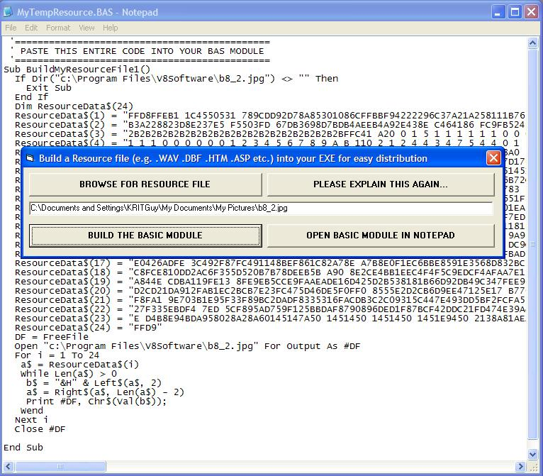



## Resource File Builder

### Description

A way to EASILY Distribute you App over the internet in a single EXE.

This program makes it easy to create BAS modules with embedded files such as:

COMDLG32.OCX, TABCTL32.OCX, MSCOMCTL.OCX

This means that your SPLASH SCREEN can automatically install components that are used by your other forms if DIR(Whatever)="".

In a nutshell, this means that you can distribute your entire application as an EXE and if executed from a ZIP file over the Internet, you do not need a separate SETUP program at all!

There is already code on PSC to handle the REGISTRATION of OCX files... so, this means that nobody needs to explain how to install an application to a user. Just Zip the final EXE and upload to your favourite download URL.

The user just downloads the ZIP, runs it and executes your program on-the-fly with self-installing components.

BTW, I have tested it with the above OCX's and it works GREAT!
 
### More Info
 
Great for small WAV files etc

Happiness and ease of use :-)

Be careful about the size of the resource file

             |
---                |---
**Submitted On**   |2006-04-07 19:11:36
**By**             |[Kevin Ritch](https://github.com/Planet-Source-Code/PSCIndex/blob/master/ByAuthor/kevin-ritch.md)
**Level**          |Advanced
**User Rating**    |4.8 (29 globes from 6 users)
**Compatibility**  |VB 4\.0 \(32\-bit\), VB 5\.0, VB 6\.0
**Category**       |[Custom Controls/ Forms/  Menus](https://github.com/Planet-Source-Code/PSCIndex/blob/master/ByCategory/custom-controls-forms-menus__1-4.md)
**World**          |[Visual Basic](https://github.com/Planet-Source-Code/PSCIndex/blob/master/ByWorld/visual-basic.md)
**Archive File**   |[Resource\_F198578472006\.zip](https://github.com/Planet-Source-Code/kevin-ritch-resource-file-builder__1-64952/archive/master.zip)

